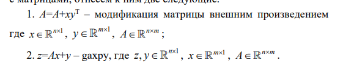
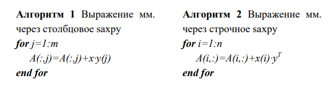
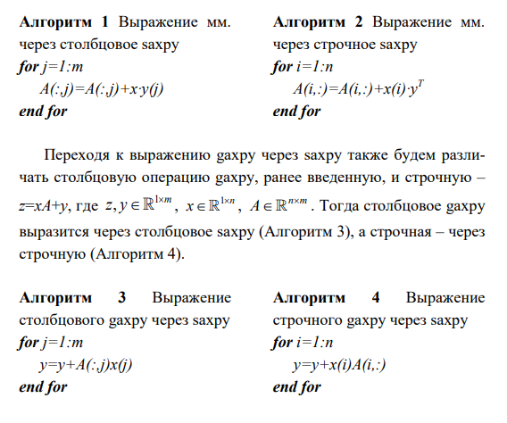
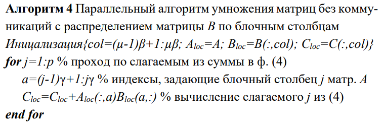
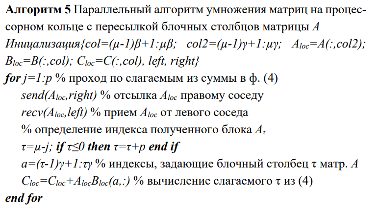
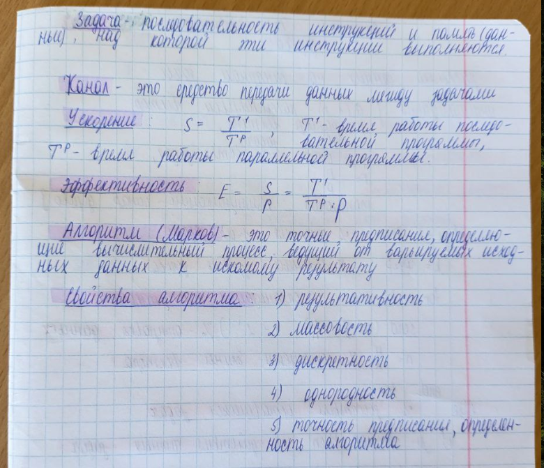

**Алгоритм** - точное предписание, определяющее вычислительный процесс, ведущий от варьируемых исходных данных к искомому результату. (Марков)

Алгоритмом принято называть систему вычислений, которая для некоторого класса математических задач из записи А «условий» задачи позволяет при помощи однозначно определенной после довательности операций, совершаемых «механически», без вмешательства творческих способностей человека, получить запись В «решения» задачи. (Колмогоров)

**3 свойства алгоритмов**:
- точность предписания, не оставляющая места произволу, и его общепонятность - определённость алгоритма 
- возможность исходить из варьируемых в известных пределах исходных данных  - массовость алгоритма
- направленность алгоритма на получение некоторого искомого результата, в конце концов и получаемого при надлежащих исходных данных - результативность алгоритма
- алгоритм должен допускать разбиение на конечное число шагов - дискретность алгоритма

