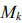
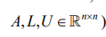

# Введение в курс

Был академик Самарский А.А. Является основоположником математического моделирования. Само математическое моделирование он разбил на три этапа, включив в него построение, собственно, математической модели, потом разработку численного метода и написание программного комплекса, который этот численный метод будет реализовывать.

> Александр Андреевич Самарский — известный специалист в области вычислительной математики, математической физики, теории математического моделирования. Создатель теории операторно-разностных схем, общей теории устойчивости разностных схем.
С 1948 года совместно с академиком А. Н. Тихоновым разрабатывал численные методы и вёл первые в СССР прямые расчёты мощности взрыва атомной, а позже — водородной бомбы, хорошо совпавшие с испытаниями. В этих работах были заложены основы математического моделирования и созданы важнейшие принципы конструирования и обоснования разностных схем и параллельных вычислений. А. А. Самарский был пионером в параллельной обработке потоков данных.

Нарисуем триаду Самарского:

Это может быть какой-то физический процесс, например дифракция света на каком-то оптическом элементе. Это может быть химический процесс, какая-то реакция. Это может быть гуманитарный процесс. Вот каким-то образом развивается общество, в нём происходят какие-то события: революции или эволюционные развития. Общество по численности людей растёт, или наоборот уменьшается, образуются классы, погибают. Всё это будет для нас объектом моделирования.

К сожалению, полностью записать объекты в виде модели со всеми его свойствами, или к счастью - невозможно, так как в этом случае модель станет самим объектом. Принято выделять из него какие-то характерные черты для типа нашего исследования.

'''

Ну например, если мы занимаемся задачей баллистики. Взяли и бросили камень под определённым углом под определённой силой, нам нужно узнать где он упадёт. Нам придётся записывать дифференциальное уравнение второго порядка, которое будет давать траекторию этого камня, а вот цвет камня нам неинтересен, белый он, чёрный он - на его баллистические характеристики это не влияет никак. То есть при этом моделировании чертами камня будут его масса, угол падения, сопротивление воздуха, объём и т.д. а цвет неинтересен. Если же нас интересуют опттические свойства камня, например, очень долгое время, пока люди ещё не высадились на луне, они изучали её на расстоянии. В том числе одним из главных инструментов этого изучения было изучение альбедо лунной поверхности, то есть отражающих свойств. Вот там цвет камня играл определяющую роль. То есть для задачи оптики цвет камня будет важен, а его масса и как мы его бросаем - уже не очень.

Следующим этапом после работы с объектом и выделения на нём характерных черт будет построение математической модели. Вспомним курс уравнений математической физики. Фактически, все эти уравнения - модели каких-либо физических процессов. Более того, часто бывает, что уравнение одно, а моделью оно служит для разных процессов. Например, возьмём уравнение теплопроводности, очевидно по названию, являющееся моделью процесса теплопроводности. Если у него же параметры уравнения иначе интерпретировать, допустим, не как температуру, а в виде концентрации вещества. оно же будет уравнением диффузии, а модель одна. 

То есть тут, как правило, какой-то математический объект. Иногда это дифференциальное уравнение, иногда это граф
