# Введение в курс

Был академик Самарский А.А. Является основоположником математического моделирования. Само математическое моделирование он разбил на три этапа, включив в него построение, собственно, математической модели, потом разработку численного метода и написание программного комплекса, который этот численный метод будет реализовывать.

> Александр Андреевич Самарский — известный специалист в области вычислительной математики, математической физики, теории математического моделирования. Создатель теории операторно-разностных схем, общей теории устойчивости разностных схем.
С 1948 года совместно с академиком А. Н. Тихоновым разрабатывал численные методы и вёл первые в СССР прямые расчёты мощности взрыва атомной, а позже — водородной бомбы, хорошо совпавшие с испытаниями. В этих работах были заложены основы математического моделирования и созданы важнейшие принципы конструирования и обоснования разностных схем и параллельных вычислений. А. А. Самарский был пионером в параллельной обработке потоков данных.

Нарисуем триаду Самарского:

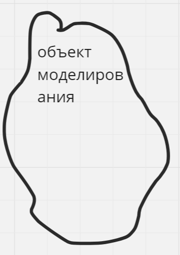

Это может быть какой-то физический процесс, например дифракция света на каком-то оптическом элементе. Это может быть химический процесс, какая-то реакция. Это может быть гуманитарный процесс. Вот каким-то образом развивается общество, в нём происходят какие-то события: революции или эволюционные развития. Общество по численности людей растёт, или наоборот уменьшается, образуются классы, погибают. Всё это будет для нас объектом моделирования.

К сожалению, полностью записать объекты в виде модели со всеми его свойствами, или к счастью - невозможно, так как в этом случае модель станет самим объектом. Принято выделять из него какие-то характерные черты для типа нашего исследования.

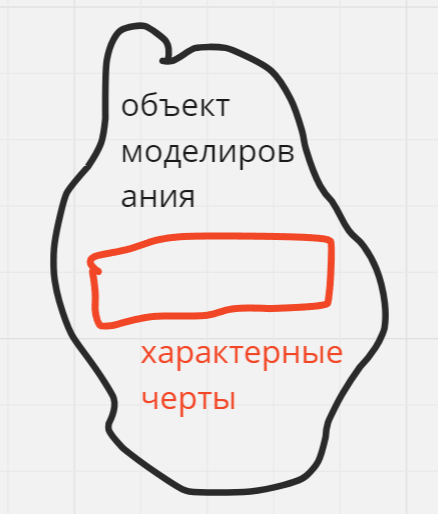

Ну например, если мы занимаемся задачей баллистики. Взяли и бросили камень под определённым углом под определённой силой, нам нужно узнать где он упадёт. Нам придётся записывать дифференциальное уравнение второго порядка, которое будет давать траекторию этого камня, а вот цвет камня нам неинтересен, белый он, чёрный он - на его баллистические характеристики это не влияет никак. То есть при этом моделировании чертами камня будут его масса, угол падения, сопротивление воздуха, объём и т.д. а цвет неинтересен. Если же нас интересуют опттические свойства камня, например, очень долгое время, пока люди ещё не высадились на луне, они изучали её на расстоянии. В том числе одним из главных инструментов этого изучения было изучение альбедо лунной поверхности, то есть отражающих свойств. Вот там цвет камня играл определяющую роль. То есть для задачи оптики цвет камня будет важен, а его масса и как мы его бросаем - уже не очень.

Следующим этапом после работы с объектом и выделения на нём характерных черт будет построение математической модели. Вспомним курс уравнений математической физики. Фактически, все эти уравнения - модели каких-либо физических процессов. Более того, часто бывает, что уравнение одно, а моделью оно служит для разных процессов. Например, возьмём уравнение теплопроводности, очевидно по названию, являющееся моделью процесса теплопроводности. Если у него же параметры уравнения иначе интерпретировать, допустим, не как температуру, а в виде концентрации вещества. оно же будет уравнением диффузии, а модель одна. 

То есть тут, как правило, какой-то математический объект. Иногда это дифференциальное уравнение, иногда это граф. То есть, например, моделировать можно работу программы. У нас есть программа, нам нужно построить её математическую модель. Программу можно выразить допустим через конечные автоматы.

Итак, есть матмодель. Это необязательно дифференциальное, интегральное уравнение, это может быть математический граф. Следующий этап - численные методы. Есл конечно у нас граф, то здесь небольшое разнообразие численных методов, но можно какой-то алгоритм обхода графа придумать. А вот если это дифференциальное уравнение, то появляются уже разные способы его решения. Например, есть аналитические методы, полуаналитические, где сочетается численное и аналитическое решения, есть чисто численные методы. Например, мы знаем о методе Эйлера, методе  Рунге-Кутты. 

> Метод Эйлера — простейший численный метод решения систем обыкновенных дифференциальных уравнений.

> Методы Рунге — Кутты — большой класс численных методов решения задачи Коши для обыкновенных дифференциальных уравнений и их систем.

Несмотря на довольно почтенную историю математики и не менее почтенную историю численных методов, о ней заговорили только недавно, более века назад. Рунге стал профессором, когда ему было уже хорошо за 70. Ему говорили, что численные методы - это для дурачков. Если есть задача, то подлинный математик должен решить всё аналитически. Записать формулу и по формуле всё рассчитать. Если аналитически он её не решит - то он дурак. Так Рунге всю сознательную жизнь троллили. Толчком к принятию численных методов как полноценного инструмента математики стала первая мировая война.

Мы занимаемся тем, что реализуем это всё в виде программы, это программная реализация. Ещё одна важная вещь, о которой Самарский не упоминает - процесс моделирования обязательно необходимо завершать проверкой адекватности модели. С первого раза почти ничего получится, поэтому существует такая проверка. Те ли черты объекта мы взяли? Ту ли математическую модель построили? Например, мы изучаем эффект Комптона. Это когда свет неожиданно начинает проявлять корпускулярные свойства. Свет - это же одновременно и волна, и частица. 

Допустим, что мы выделили из модели не то свойство, не корпускулярное, а волновое. Изучая волновое свойство, эффекта Комптона мы не получим. Записали для него уравнение Максвелла, решили его численно, составили программку. Вычисляем, а эффекта нет. Ну естественно, мы же не те свойства у модели выделили. Допустим, что мы наконец догадались, что свойства корпускулярные, и решать нужно не уравнение Максвелла, а допустим, уравнение Шрёдингера. Записали это уравнение, но решили выбрать для него явный численный метод. А явные схемы все для него расходятся, не получили решение. И вот так, проходя по каждому из этапов вплоть до последнего этапа программной реализации, нам приходится всё это дело просматривать.

Чем ценна эта триада Самарского? Тем, что на её примере очень легко разбирать место того или иного курса в системе обучения. Если изучаете физику, то значит изучаете объект моделирования, если дифференциальные уравнения - значит, конкретные математические модели. если изучаем численные методы - значит изучаем способы решения математических моделей. Посмотрим, где наш предмет:

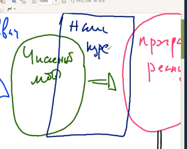

Какие свойства численных методов помним? Устойчивость, единственность решения и его существование (корректность). 

Проблема нашего курса - чтобы метод считался быстро. Например, задача умножения матриц. Она кажется простенькой, но решается очень долго, так как у неё колоссальная вычислительная сложность - U(n^2). Естественно, хотелось чтобы всё решалось быстрее. 

В математике для этого есть такое понятие как вычислительная сложность метода. При прочих равных предпочтение отдаётся тому методу, у кого она меньше. К сожалению, математики часто неверно интерпретируют вычислительную сложность как количество арифметических операций. Дело в том, что кроме количества арифметических операций есть ещё операции, которые делает компьютер. Он выделяет память, обращается к памяти. И очень часто численный метод, который характеризуется меньшим количеством арифметических операций, работает дольше из-за неуклюжей работы с памятью. У нас операции делаются в регистрах процессора. А до попадания в регистры нужно информации нужно быть считанной из оперативной памяти, пройти через все кэши процессора. Потом попасть в регистр, там с ней сделают что-то. И информация пойдёт обратно.

Все эти операции на современных процессах делаются одновременно, но всё это очень существенно влияет на характеристики метода. Наша главная цель курса - заниматься теми численными методами, которые работают быстро. Если вы заметили, то математикам неинтересно, как устроена архитектура компьютера. Они под "быстро" имеют в виду количество арифметических операций. Для нас же архитектура компьютера будет очень важна. Это особенность нашего курса - учёт архитектуры электронно-вычислительной машины. Это то, что отличает наши численные методы от всех остальных.

У нас главной целью будет создать численный метод, который на определённой архитектуре, а их довольно много, будет работать быстро, или по крайней мере быстрее аналогов.

Подумаем, какие же архитектурные особенности бывают, какие нужно учитывать. Открыли мы системный блок. Что там такого, что нам придётся учитывать? Объём памяти, иерархическая структура памяти, скорость шин данных, количество ядер. Одно дело создать численный метод для одного ядра, другое дело - для двух. Например, есть метод прогонки для решения системы трёхдиагональных уравнений. Иногда его называют метод Томаса (в России придумал академик Гильфандо). Он состоял из двух этапов. У нас есть матрица трёхдиагональная и матрица системы, которую нужно решить. На первом этапе, так называемом прямой прогонкой, находились прогоночные коэффициенты `alfa` и `beta`. Находились обязательно рекуррентно. Сначала `alfa1`, потом `alfa2`, и также с beta. Нельзя было найти прогоночный коэффициент с некоторым номером без нахождения коэффициентов с номером ниже этого. Потом начинался обратный ход прогонки, где мы находили из прогоночных коэффициентов неизвестные системы, уже в порядке убывания номеров.

Это означает, что будь у нас хоть два ядра, хоть 200 ядер, мы не сможем их загрузить работой. Если мы собираемся рещать вот эту задачу, то метод прогонки нам не годится. Нужно придумывать новые методы.

Есть особенности архитектуры, под которые известные методы просто могут не подходить. Значит нужно использовать старые другие, или придумывать новые, вычисления по которым можно будет организовать одновременно (паралелльно).

А как именно всё это выдумывается? Допустим, нас вызвали в институт, который занимается биологическими исследованиями и сказали: "Вот мы тут изучаем структуру белка. Очень простенькая задача, даже есть программка готовая. И раньше нас вполне устраивало, как она работает, а теперь информации в 100 раз больше, и нам хотелось бы, чтобы нам дали многоядерный процессор, а лучше суперкомпьютер. И вы, учитывая такой большой объём информации быстро нам всё решите, ну хотя бы за сутки". И тут мы начинаем думать, у вас есть объект, есть численный метод и математическая модель, но это же биология, я в этом ничего не понимаю. А нам говорят, что любой студент 2 курса биофака это знает. Для них то просто, а что делать нам? А от нас ждут решения задачи, максимум через неделю. 

> 1. Автоматическое распараллеливание

Самый простой метод составления параллельных алгоритмов называется `автоматическое распараллеливание`. Его главная особенность в том, что мы можем совершенно не знать предметной области. То есть нам нужна из всего только программа. А что программа делает? Она извлекает из памяти данные, производит с ними арифметические операции и возвращает обратно.

Какие есть средства автоматического распараллеливания. То есть допустим есть последовательная программа, мы ставим в ней пару директив, значков, галочек и она становится уже параллельной.

Мы изучим математический аппарат, на котором основано это автоматическое распараллеливание.

> 2. На основе имеющегося последовательного алгоритма делаем из него параллельный 

На основе имеющегося последовательного алгоритма делаем из него параллельный алгоритм. Автмоатическое распараллеливание, несмотря на то, что оно быстро работает, оно как правило, делается плохо. Если у нас случай нестандартный и никаких рецептов нет, то ничего из него не получится. А здесь уже придётся думать и по некоторым правилам из последовательного сделать параллельный алгоритм. Тут тоже не всегда получается гладко. Ранее мы привели метод прогонки, который не параллелится. 

> 3. Разработка численного метода, ориентированного на параллельное исполнение

И, наконец, когда у нас нет ни алгоритма, ни иногда даже численного метода, нам приходится синтезировать численный метод, сразу ориентированный на параллельное исполнение.

> ЗДЕСЬ БЫЛ ПЕРЕРЫВ

Посмотрим на дело с математической точки зрения, не думая об архитектуре. Создадим алгоритм, который математики называют быстрым, содержащий меньшее количество операций, чем его аналог.

Блочность основана на том, что почти все операции по алгоритму переводятся в операции умножения матриц. Поэтому быстро умножать матрицы - важно. Приведём пару таких алгоримов быстрого умножения матриц.

> **Умножение матриц по Винограду**

Виноград подметил одну интересную особенность. Допустим, есть три матрицы A, B и C. Их размерности соответственно i на n, n на j, i на j

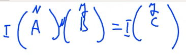

Как по определению находится элемент `c_ij`?

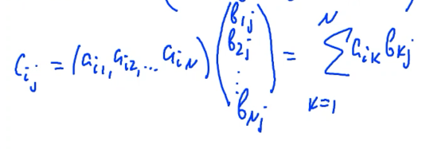

Виноград сказал - хорошая формула. Но я напишу то же скалярное умножение, но оно будет лучше.

По Голубу этот элемент будет находиться так. Мы уже подразумеваем, что `n` будет нацело делиться на `2`.

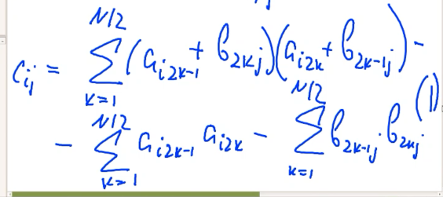

Посчитаем количество операций при нахождении одного элемента `c`. Умножение - `n` операций. Сложение - `n-1`.

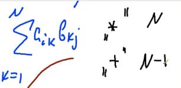

Вернёмся к тому, что придумал Виноград.  Умножение - `3/2 * n` операций. Сложение - `5/2 * n - 1`.

Утверждаем, что Виноград - мошенник. Но он бы сказал, что нужно не подсчёт одного элемента делать, а смотреть на матрицы сразу. В формуле есть второе и третье слагаемые.

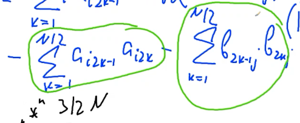

Приглядевшись ко второму слагаемому внимательнее, мы видим, что здесь строка, то есть индекс `i`, не меняется. И подсчитав для одной строки единожды эту сумму, мы можем использовать её многократно для расчёта всех элементов матрицы `C` этой же строки. Посмотрев на третье слагаемое, видим, что не изменяется индекс `j`. Подсчитав единожды эту сумму для столбца, мы можем его использовать его многократно при расчёте всех элементов j-того столбца матрицы С.

Покажем это на примере. У нас также три матрицы A, B и C. Допустим, что мы посчитали второе слагаемое нашей формулой для i-той строки матрицы `A`. Один раз посчитали одно слагаемое. Единожды посчитанное оно потребуется столько раз, сколько мы его будем применять при вычислении этой i-той строки матрицы `C` - `j` раз

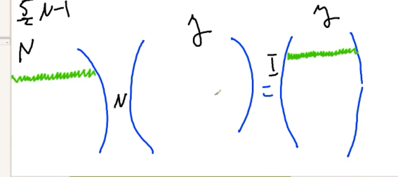

> Единожды вычислив второе слагаемое формулы Винограда можем задействовать его `J` раз при вычислении `J` элементов i-той строки матрицы `C`.

Теперь, допустим, мы посчитали третье слагаемое для фиксированного `j`. Этой суммой мы прошли j-тый столбец матрицы `B`. Перемножили попарно соответствующие элементы суммы и сложили в одно число. Мы его можем использовать столько раз, сколько элементов в j-том столбце матрицы `C`.

> Единожды вычислив третье слагаемое формулы Винограда для фиксированного значения `j` можем использовать его `I` раз для нахождения всех элементов j-того столбца матрицы `C`.

> **Умножение матриц по Штрассену**

Вот такие матрицы:

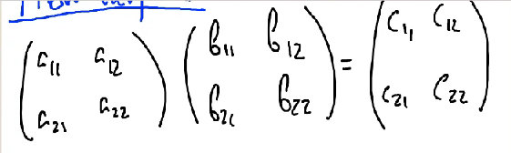

Нам необходимо найти элементы матрицы C, но перед этим мы найдём 7 промежуточных элементов, которые Штрассен обозначил за `p`.

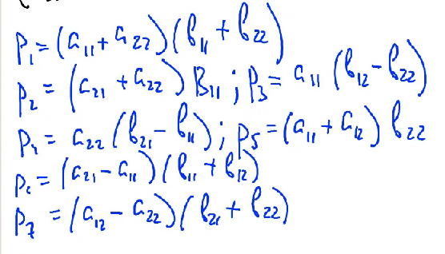

Теперь найдём из этих `p` найдём элементы матрицы `С`:

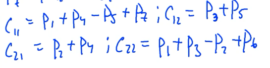

Посмотрим на количество умножений и сложений у обычного метода и Штрассена.

В обычном методе умножений - 8, сложений - 4. У Штрассена умножений - 7, так как в каждом `p` их по одной штуке, сложений - 18.

Выиграли 1 умножение, проиграли 14 сложений. Интуитивно понятно, что одно умножение - более сложная операция и делается дольше одного сложения, но не дольше же, чем 14. Поэтому возникает лёгкое недоумение.

Причин для работы Штрассена две, и первая - блочность. Метод Штрассена в обычном варианте, допустим, для матрицы 2 на 2, даёт праивльный результат, но работает намного дольше. Быстрее он начинает работать только в блочном варианте.

> Первое условие применения Штрассена - работа с блоками.

Работа с блочными матрицами аналогична работе с обычными, с той лишь разницей, что вместо элементов у нас фигурируют блоки а остальное всё то же самое.

Представим. что теперь эта матрица у нас не 2 на 2, а 1024 на 1024. мы просто делим на блоки, каждый из них размером 512 на 512. И дальше с этими блоками делаем все эти операции, где умножение - это не умножение чисел, а умножение матриц, допустим по стандартному алгоритму. Тогда получается, что мы не просто вместо одного умножения в виде выигрыша и проигрыша 14 сложений получаем вот эти операции (а это операции с матрицами). Мы выиграли одно умножение матриц и програли 14 сложений матриц.

В обычном алгоритме всех операций 2n^3-n^2. Мы выиграли одно умножение, а одно умножение, это O(n^3) операций. И проиграли 14 сложений. При сложении матриц всего операций n^2. Значит O(n^2) операций. Как только мы представим, что это `n` достаточно велико, то при `N` большем этой величины, наш метод Штрассена начинает выигрывать. То есть при каком-то N число умножений и сложений количество операций будет одинаково. То есть одно матричное умножение по общей сложности будет равно 14 сложениям. При `N` меньшей этой величины обычный метод лучше, при `N` большем этой величины Штрассена - лучше. Засчёт того, что в одном умножении оказывается больше арифметических операций, чем в 14 сложениях, ибо мы умножаем и складываем отныне не числа, а блоки, то есть сами матрицы.

Ещё раз вот у нас есть сравнение умножения и сложений

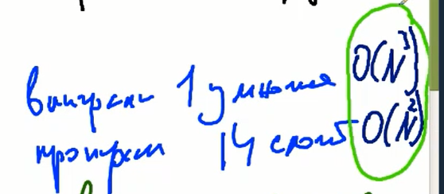

Понятно, что умножений больше в операции работы с матрицами, чем сложений, причём при росте `N` эта разница будет всё увеличиваться и увеличиваться.  И при `N` больше некоторого оказывается, что 14 сложений вызывают меньшее количество операций, чем одно матричное умножение.

Пока что первая очевидная выгода - это блочность. При работе с блочными матрицами мы экономим одно матричное выражение, а в нём намного юбольше операций, чем в 14 матричных сложениях, поэтому Штрассена оказывается выгоднее.

> Второе условие применения - рекурсивность (внутри Штрассена умножаем блоки по Штрассену)

Мы сейчас все эти оценки делали исходя из того, что в методе Штрассена мы умножали блоки обычным способом. А кто мешает смотреть нам на умножение этих блоков, как матриц? И тоже сделать их по Штрассену. Это называется рекурсивность. Это ещё больше разгоняет алгоритм, делает вычисления по нему ещё более выгодными.

> Устойчивость Штрассена

Методом Штрассена пользуются редко, потому что у него проблемы с устойчивостью. Приведём пример. Представим, что у нас компьютер, у которого хранятся два знака мантиссы и один знак порядка, а всё остально теряется. Конечно таких компьютеров нет, но можно привести пример для скорости. У нас есть две матрицы, одинаковые которые умножаются, то есть мы практически возводим матрицу в квадрат. Каждая из этих матриц прекрасно умещается в том формате чисел, которые мы заявили.

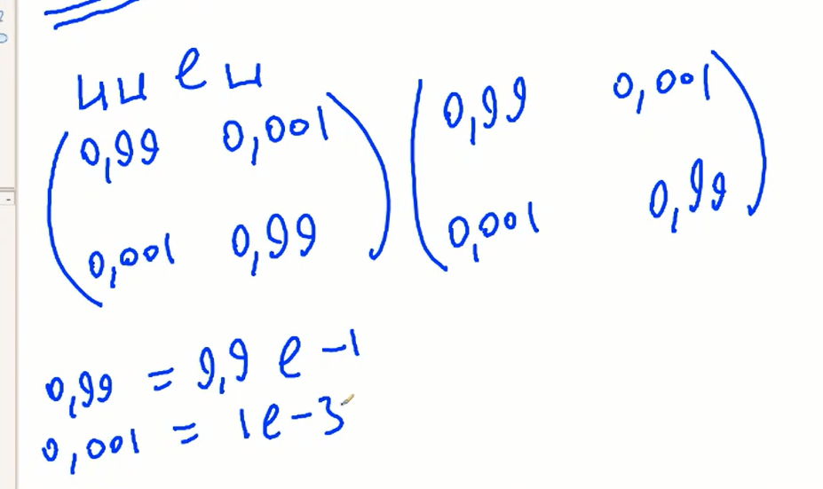

Найдём для определённости `c_12 = p3 + p5`. В свою очередь, `p3 = 0.99(0.001 - 0.99) ~ -0.98`. И `p5 = (0.99 + 0.001)0.99 ~ 0.98`.

Подсчитаем `c_12 = -0.98 + 0.98`

Подсчитав обычным способом:

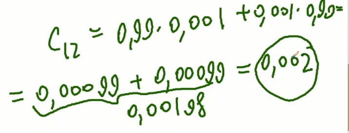

Представим, что в алгоритме на `c_12` нужно делить. Если мы умножили матрицы по Штрассену, это деление окончится драматически. Если мы умножили обычным методом, при округлении получаем погрешность около процента. То есть у нас ошиби в округлениях выносят ошибки в расчётах, причём метод обычный оказался устойчивым,а Штрассена - нет. И вот так мы видим, что он может посчитать что-то неправильно, хоть и быстро.

Обычно неустойчивость в Штрассене проявляется особенно остро в том случае, если матрицы имеют вырожденные диагональные преобладания. На главной диагонали в нашем примере значения были больше чем на 1 и -1 диагоналях.

есть такая гипотеза, что можно придумать метод, у которого вычислительная сложность умножения матриц - O(n^2). У обычного метода - O(n^3), у Штрассена - O(n^2.8), у самых передовых - O(n^2.38) - это метод Винограда-Коперсмита. Но даже методом Винограда-Коперсмита не пользуются из-за колоссальных затрат памяти и считать он будет дольше. Штрассен встроен в стандартные библиотеки.