# Лекция 2

## 1.1 Модели в теории параллельных вычислений

В численных методах необходимо учитывать архитектуру вычислительного комплекса. Мы заменим глубокое разбирательство в архитектуре набором небольших и простеньких моделей, которыми будем в рамках курса довольны

> Параграф 1.1. Модели архитектур вычислительных систем

У нас ещё будут модели алгоритмов и модели вычислительных процессов. Под моделями мы будем понимать не те математические модели, которые были в 1 лекции, когда описывали предметную область курса. Это, так сказать, описания, содержащие характерные и нужные нам далее особенноси объекта, а всё остальное - несодержащие. Этим стали заниматься в середине 60-х годов. Архитектур вычислительных систем к тому времени накопилось много и нужна была какая-то их систематизация. Нужно было согласовывать, так как для каждой модели был свой способ программирования и языки.

> Классификация Флинна

Первая успешная классификация была придумана Флинном. На неё много критики и часто осбоснованной, но все классификации, появившиеся позже - хуже. Флинна рассматривают до сих пор. 

Что лежит в её основе? В те времена развивалась кибернетика, на неё возлагались огромные надежды. Чтобы воздействовать на общество. В кибернетике, когда рассматривают какой-либо объект, перед его изучением, то называют слова "чёрный ящик". Допустим, у нас есть изучаемый объект, что у него внутри мы рассматривать не будем. Но будем делать выводы об устройстве по его внешним характеристикам: по тому, что входит в объект и по тому, что из него выходит. Что выходит - рассматривать не будем, а что в компьютер входит - об этом Флинн задумался. В частности, допустим это ЭВМ, в неё входят данные и инструкция, то есть указание, что с этими данными делать. 

> Если действия внутри ЭВМ определяется, в первую очередь, потоком инструкций, то говорят о синхронных в широком смысле вычислениях. Когда наоборот, то есть действия задаются данными, то говорят об асинхронных вычислениях.

Мы привыкли к первой формулировке. То есть у нас есть программа. Линейно, один за другим, расположены операторы. Операторы это и есть инструкция. Естественно, что инструкции работают над данными, то есть поток данных нужен. Но все действия задаются именно инструкцией.

О чём дальше задумался Флинн? Он решил построить следующую табличку. Собственная классификация Флинна. Итак, у нас два потока: данные и команды. Мы разделим на два случая: когда поток данных единственнен и когда множество потоков данных.

Добавим один поток комманд и множество потоков команд

Когда у нас один поток команд и один поток данных, то принято говорить о машине фон Неймана. У американцев принято использовать аббревиатуру SISD (Single instruction, single data)

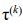

Когда у нас один поток команд, но множество потоков данных, то имеется в виду векторная архитектура (векторный процессор) - SIMD (Single instruction, multiple data)

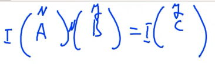

Удачная классификация предвосхищает новое открытие своих элементов. Менделеев в своей классификации указывал, что есть ещё несколько неоткрытых элементов. Некоторые ячейки были пусты, но он заранее предсказал их свойства. То же самое было у Флинна. Так он предсказал конвейерную ЭВМ - множество потоков команд и один поток данных - MISD (Multiple Instruction, Single Data).

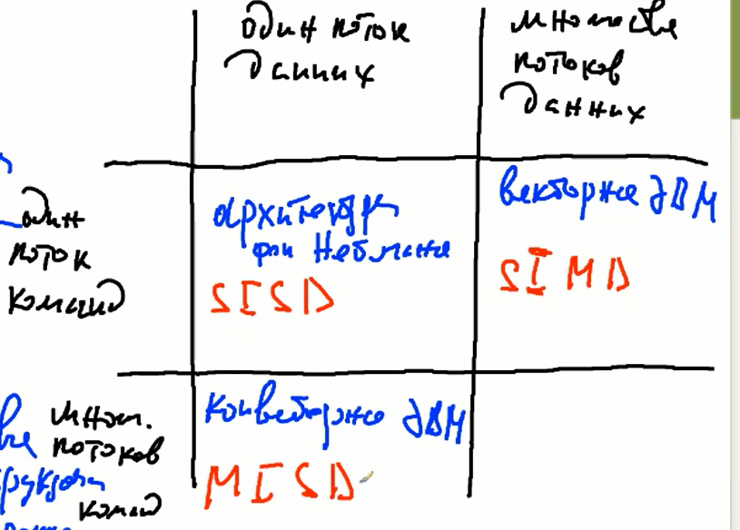

Любой процессор сейчас имеет конвейер.

Последнее - когда множество потоков команд и множество потоков данных - многопроцессорные ЭВМ - MIMD (Multiple Instruction, Multiple Data). За это его тоже критиковали за то, что непонятно, какие же именно многопроцессорные, их много разных. Для этого, в этом месте рассмотрим классификацию не Флинна, а Хокни, которая появилась позже Флинна.

> **Машина фон Неймана**

Нарисуем модель машины фон Неймана. У нас есть процессор, память. Они определёнными образом взаимодействуют. Данные извлекаются из памяти, помещаются в процессор, там обрабатываются и возвращаются обратно. Есть два потока: единичный поток команд, где одна за другой команды последовательно поступают в процессор и единичный поток данных. Когда пишут про ахитектуру Неймана, то особенно подчёркивают, что команды находятся тоже в памяти, что они из памяти извлекаются как и данные, и по сути являются довольно специфически, но типом данных. Наши рассмотрения это справедливое замечание немного размывает, поэтому мы его не упоминаем.

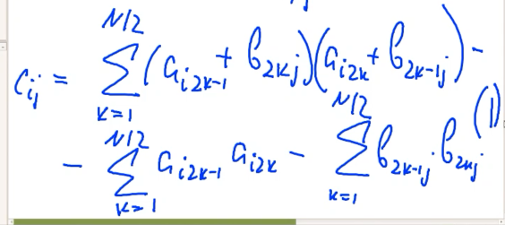

На практике никогда такого не было, чтобы была создана эта архитектура. Чистый компьютер по архитектуре фон Неймана был создан исключительно недавно для демонстрации. 

> Мы должны запомнить, что команды идут последовательно, одна за другой и исполняются над данными, которые из памяти извлекаются тоже последовательно, одни за другими.

> **Векторная ЭВМ**

Следующая архитектура - векторная. Её можно получить из фон Нейма, если немного иначе рассмотреть процессор, более подробно, выделив в нём устройство управления, которое работает со множеством арифметико-логических устройств (АЛУ). В устройство управления входит один поток команд, а арифметико-логические устройства непосредственно взаимодействуют с памятью. Взаимодействуют таким образом, что исполняют одну команду, устройство управления её дублирует, но исполняют её над разными областями памяти, что фактически соответствует множественности потоков данных.

Какое преимущество даёт такая архитектура, по сравнению с фон Неймовской? То что у нас пусть одна операция, но сразу делается над многими данным. Вот эти многие данные фактически можно представить как элементы одного вектора. 

Можно сделать всякие операции ещё и с матрицами. Есть ещё матричные процессоры. Это необязательно ЭВМ, есть оптические матричные процессоры, где мы светим лазором на линзу и фактически выполняем на ней умножение матрицы на столбец. 

Выгода в том, что мы за то же самое время, за которое на машине фон Неймана делали одну операцию, десь делаем много операций над элементами векторов или элементами матриц. Разумеется, в этом случае, коль операций много за единицу времени, наш алгоритм будет работать быстрее.

Недостаток таких процессоров в том, что далеко не все алгоритмы можно успешно векторизовать.

> Достоинство - ускорение вычислений за счёт одновременно исполняемых операций над разными компонентами вектора.

> Недостаток - не все алгоритмы допускают представление в веторной нотации

> **Конвейерная ЭВМ**

Рисуем. Есть процессор 1, память 1. Меджду ними происходит взаимодействие. Дальше процессор P и его память P. Сейчас у современных конвейерных ЭВМ конечно речь идёт не о процессоре, а о части процессора, о каком-то наборе исполнительных устройств. Это неполный процессор. У нас есть поток команд, их много. Есть поток данных, он один, но длинный и проходит через все памяти. 

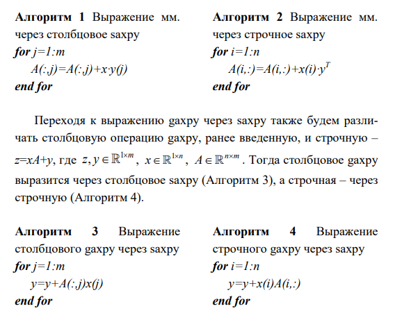

Ускорение вычислений происходит за счёт того, что для данных, которые находятся в разных местах этого потока, действие происходит одновременно.

> Ускорение вычислений связано с одновременностью исполнения команд на разных этапах обработки одного потока данных

Приведём пример. Видеокарты с одной стороны считают чисто векторными архитектурами, но с другой стороны везде пишут, что эта векторизация основана на конвейере, то есть видеокарты - это одновременно и то, и другое. То есть на высоком уровне видеокарты считаются векторной архитектурой, а на низком - векторизация основана на конвейеризации.

Представим, что принимаем со спутника картинку, причём он передаёт непрерывно видеоряд с наборами из картинок. И мы принимаем его каким-либо процессором, второй производит повышение контраста на картинке, которую приняли до этого. Третий выявляет на картинке с повышенным контрастом танк. Четвёртый процессор выдаёт целеуказания, допустим, для БПЛА, чтоб поразить этот танк. Танк движется, нам поступают новые картинки, целеуказание корректируется. Поток данных у нас один, но мы его разбиваем на картинки и разные фрагменты в один и тот же момент времени подвергаются разной обработке разными командами.

> Особенности
> - Необходима загрузка конвейера. 

То есть мы ожидаем, что из процессора P каждый раз будет выходить на каждом такте обработки результат. То все эти P операций будут делаться одновременно и за один такт у нас будет новый результат после загрузки конвейера. В отличие от векторной, конвейерная архитектура позволяет получить ускорение, но не сразу, после определённого набора этапов. Этот набор называется загрузкой. Если есть загрузка, есть и выгрузка.

Представим что все операции, которые мы производим таким образом, занимают разное время. Естественно, та операция, самая затратная по времени, будет нас сильно тормозить и мы можем не получить ускорении. При конвейерном решении задачи нам нужно разбить алгоритм на такие операции. чтоб они на конвейере работали примерно одинаковое время

> - Ожидается распределение операций по конвейеру такое, чтобы они исполнялись одинаковое время (итальянской забастовки не получится)

Не каждый алгоритм можно разбить на P количество операций, которое будет исполняться одновременно

> ЗДЕСЬ БЫЛ ПЕРЕРЫВ

> **Классификация Хокни (MIMD)**

К их числу Хокни причислил конвейерные ЭВМ. Возможно он говорил так - Флинн написал хорошо, но он же говорил о процессорах определённым образом, значит, это многопроцессорная ЭВМ. Он также подчеркнул, что есть переключаемые ЭВМ и сети.

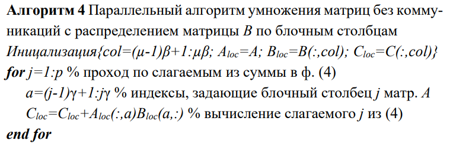

Фактически, в этой классификации речь идёт о способах связи процессоров или вычислительных устройств, ядер друг с другом. Если это, допустим, связь по типу конвейера, один идёт за другим и кушает информацию, который ему даёт предыдущий - то Хокни их назвал конвейерными ЭВМ. Переключатели - это если все связаны со всеми. В свою очередь, такие ЭВМ делятся на два класса - с общей памятью и с распределённой памятью

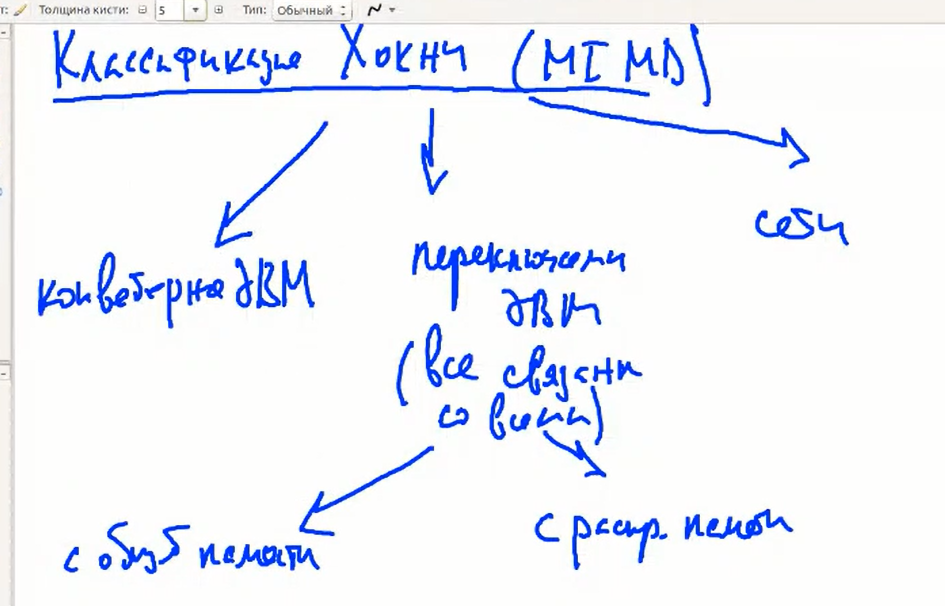

> Переключаемые ЭВМ с общей памятью

Вот у нас есть память, есть процессор 1, процессор 2 ... процессор p. У каждого процессора может быть своя локальная небольшая память (кэш процессора), и там как правило много данных не умещается. Все они взаимодействуют с общей памятью, извлекают из неё данные и возвращают обратно.

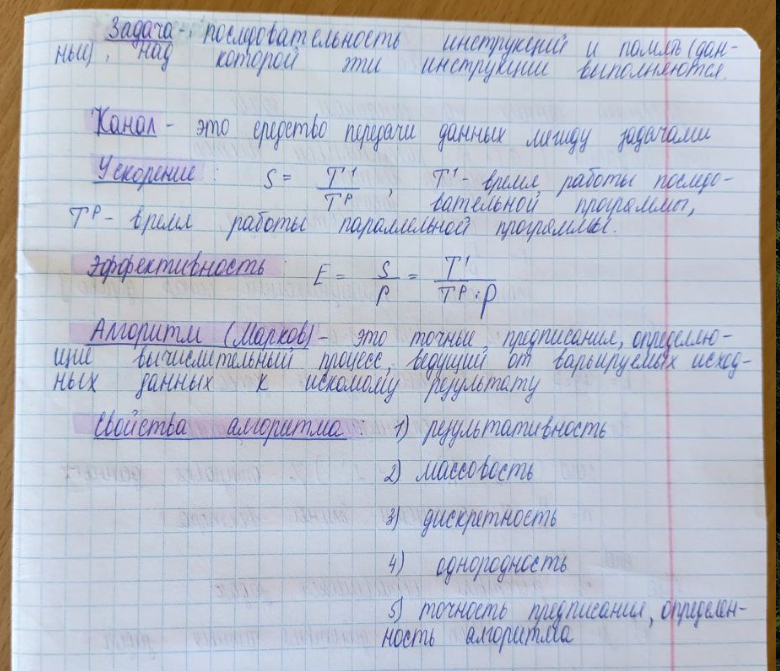

Современный ядерный процессор таким и является. Какие могут возникнуть проблемы? С тем, что мы одновременно будем стараться писать в одну и ту же область памяти. На аппаратном уровне это решится, а на алгоритмическом уровне появляется проблема неопределённости результата. Допустим, два процессора изменили одну и ту же переменную, что же выведется? Неизвестно. Рушим важнейшее свойство алгоритма - детерминированность. Это называется проблемой взаимного исключения. Есть разные уровни решения. То есть здесь есть проблема воспрещения одновременного доступа к памяти. 

> Проблема - воспретить одновременную запись разных процессоров в одну оласть памяти.

> Переключаемые ЭВМ с распределённой памятью

Это означает, что у каждого процессора память своя. В кружочке одновременно находится и процессор и папмять, над которой он работает. Все могут взаимодействовать со всеми, даже сами с собой.

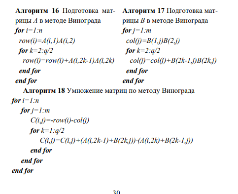

С одной стороны - это хорошо. Кому хотим данные - тому и посылаем, никаких ограничений. Проблема в том, что обеспечить одновременный доступ большому количеству процессоров друг к другу - технически очень сложно. Если есть комммуникаторы - при десятках процессоров помогут, но не при сотнях. 

> Для большого числа процессоров обеспечение полносвязаной топологии коммуникаций невозможно

Есть такое понятие, как инвариант Яненко. Он означает, что какая бы не была вычислительная техника, какие бы не были задачи, всегда на любом этапе развития техники и задач, найдутся такие задачи и такая техника, которая будет решаться медленно, быстро и очень медленно. То есть всегда будут перед нами вставать такие задачи, которые на существующей технике будут решаться месяцами. Поэтому наши процессоры надо объединять в суперкомпьютеры.

> **Сети**

Сети - фактически способы связи процессоров, где эта связь неполносвязна.

> 1 - Процессорная линия

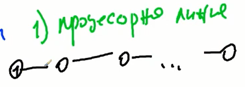

 У всех процессоров есть соседи.

 > 2 - Процессорное кольцо

 Если видим, например, умножение матриц на процессорном кольце, это значит, что перед нами описание параллельного алгоритма умножения матриц, ориентированного на исполнение на процессорном кольце. Кольцо - это та же линия, но в которой первый и последний процессор соединены.

 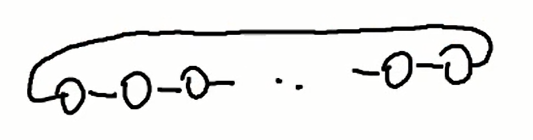

Это были одномерные топологии. Перейдём к двумерным.

> 3 - Процессорная решётка

Если есть линия в одномерном, то в двумерном - это решётка

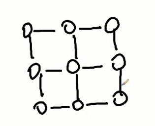

> 4 - Тор

Можно сделать двумерную топологию не из линии, а из колец - тор

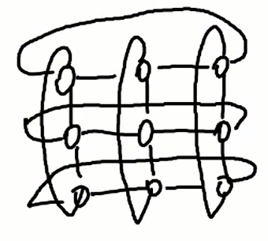

> 5 - Звезда

Когда у нас есть выделенный центральный процессор, его называют Master. Остальные, с ним связанные - называт Slave. Когда мы говорим об организации параллельных вычислений, параллельность понимается под одновременностью, мы хотим одновременно что-то вычислять. Под вычислениями мы ранее понимали исключительно производство арифметических операций. Теперь мы видим, что вычисления - не только производство операций, но ещё и коммуникации. Коммуникации со своей памятью и между процессорами. При параллельных алгоритмах мы ожидаем одновременности для разных процессоров как арифметических действий так и комммуникаций.

Допустим, на процессорной линии процессоры могут разослать данные своим соседям. А в звезде один процессор может исполнять только последовательные действия и арифметические, и коммуникационные. Наш ЦП может послать данные не одновременно 2 и 3, а только последовательно. Параллельный алгоритм в смысле и арифметических операций, и комммуникаций на звезде невозможен.

> 6 - Бинарное дерево

Здесь эта проблема решается. Пусть у нас есть 8 процессоров. Фиктивная связь изображается пунктирной линией.

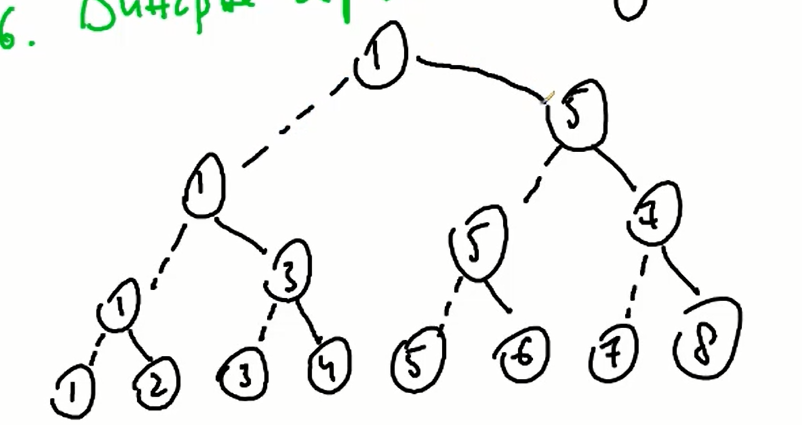

В этом случае, 1 процессор будет посылать данные остальным 7 последовательно и нам потребуется ждать 7 последовательных передач. На бинарном дереве 1 процессор отдаст данные, допустим, 5-ому. Это единственная последовательная передача, потом одновременно 1-ый 3-ему, 5-ый 7-ому. Потом 1-ый 2-ому, 3-ий 4-ому, 5-ый 6-ому, 6-ой 8-ому

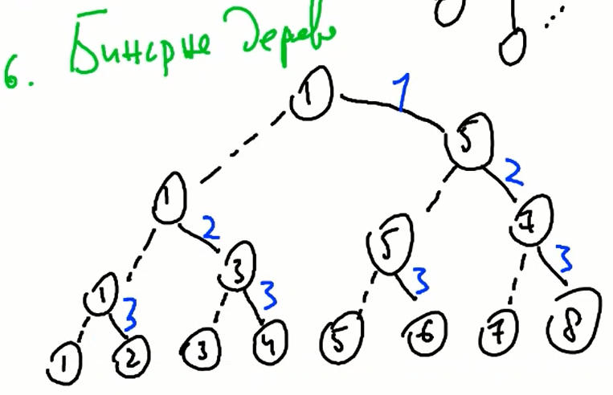

То есть на звезде было 8 передач, а на дереве 3

> 7 - Гиперкуб

У гиперкуба есть параметры, именуемые степенью.

`p = 2^k`

k - степень гиперкуба (число соседей каждого процессора)

Допустим, `k = 0`. В этом случае имеем машину фон Неймана. При `k = 2` имеем 4 процессора.

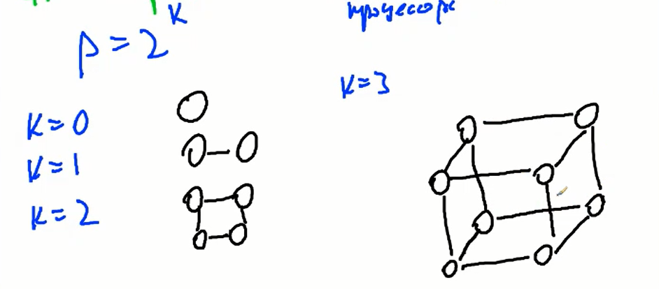

Чем хорош гиперкуб? Тем, что на нём можно отобразить остальные топологии, кроме звезды. Например, гиперкуб размерности 3. Используя одни его связи и игнорируя другие, вполне можно построить линию, кольцу, даже угадывается дерево. В этом смысле гиперкуб когда-то был очень популярным. он с одной стороны неполносвязный, а с другой стороны степень связности у него довольно высокая. Но с большим количеством процессоров его не используют.

## 1.2 Модели алгоритмов

Под моделями понмаются формы и представления алгоритмов. Начнём с того, что такое алгоритм. Раньше студенты писали, что алгоритм, это последовательность действий, но тогда он не может быть параллельным. В рамках курса последовательность и параллельность - антонимы. Действия - это вычислительный процесс. Когда у нас процессор действует, обрабатывает данные, производит действия над данными по набору команд, то это вычислительный процесс, а не алгоритм. Алгоритм - это запись. если мы написали на листочке, алгоритм может никогда не реализоваться. А если мы написали программу и запустим её на компьютере, это и будут действия - вычислительный процесс. Алгоритм и процесс - разные понятия. Алгоритм - в мыслях,  нематериален. Процессс - материален.

Определение алгоритму давали Колмогоров и Марков (2 определения).

> Алгоритм - точное предписание, определяющее вычислительный процесс, ведущий от варьируемых исходных данных к искомому результату. (Марков)

> 3 свойства алгоритмов:
> - точность предписания, не оставляющая места произволу, и его общепонятность - определённость алгоритма 
> - возможность исходить из варьируемых в известных пределах исходных данных  - массовость алгоритма
> - направленность алгоритма на получение некоторого искомого результата, в конце концов и получаемого при надлежащих исходных данных - результативность алгоритма
> - алгоритм должен допускать разбиение на конечное число шагов - дискретность алгоритма

В современном мире, под результативностью понимают свойство, требующее, чтобы алгоритм за конечное число шагов или выдал результат, или сообщение о том, что задача не решена.
