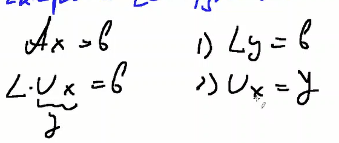
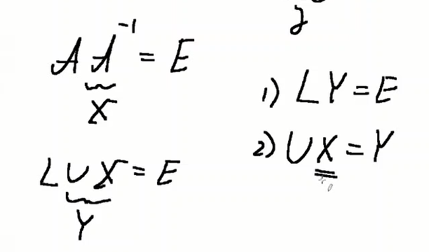
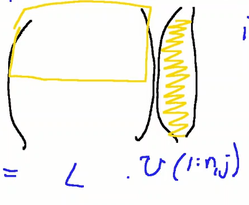

# Лекция 9

## 3.2 Решение СЛАУ с матрицами треугольного вида

Рассмотри на примере треугольных матриц. Есть `Lx=b`, где `L`:


Есть вектора `x` и `b`.


Вот у нас есть такая система. Начнём с `x_1`:


Далее `x_2` и далее:


Мы видим здесь векторную операцию - скалярное произведение


Так можем выразить `x_i`:


Получается вот такое произведение, где столбец x - столбец из неизвестных, которые уже известны.


Теперь сам алгоритм. Рассмотрим алгоритм с замещением - то есть мы будем писать результат поверх начальных данных. То есть в нашем случае пишем `x` поверх `b`. Это даёт два преимущества: экономия данных и экономия операций.

Мы по-прежнему рассматриваем `Lx=b`. `L` - нижнетреугольная матрица. Тогда пишем алгоритм:

**Алгоритм прямой подстановки через скалярное произведение**
```
b(1) = b(1) / L(1,1)
for i=2:n
    b(i) = (b(i) - L(i,1:i-1)b(1:i-1)) / L(i,i)
end for
```

`L(i,1:i-1)b(1:i-1)` - скалярное произведение

Это векторная форма

Если L - унитреугольная матрица, то есть все элементы на главной диагонали равны - то алгоритм укорачивается:

```
for i=2:n
    b(i) = (b(i) - L(i,1:i-1)b(1:i-1))
end for
```

Здесь мы к матрице L обращаемся по строкам. Но если будем идти по столбцам, то он никуда не годится, будет работать медленно.

Вернёмся к нашей матрице:


Найдём `x_1` и избавимся от него таким образом. Тогда берём 


То, что зелёным - не берём, так как это коэфффициенты для `x_1`


Тогда посмотрим на правую часть, куда и переносим эти коэффициенты:


Так получили новую редуцированную систему. Тогда `x_2`


Здесь мы применили векторную операцию - saxpy. Мы решаем ту же самую систему `Lx=b`

**Алгоритм прямой подстановки с использованием saxpy**

```
for j=1:n-1
    b(j) = b(j) / L(j,j)
    b(j+1:n) = b(j+1:n) - L(j+1:n,j)b(j)
end for
b(n)=b(n) / L(n,n)
```

Если L - унитрегольна, будет такой алгоритм с операцией saxpy

```
for j=1:n-1
    b(j+1:n) = b(j+1:n) - L(j+1:n,j)b(j)
end for
```

## 3.3 Векторные алгоритмы LU-разложения

У нас есть матрица `А`. Мы ищём её в виде произведения двух матриц - `А = LU`. L - нижнетреугольная матрица, U - верхнетреугольная матрица.

Зачем нужно LU - разложение? Во-первых для решения СЛАУ:



Можно находить обратную матрицу:



Можно использовать также для решения задачи на собственные значения. Можно легко найти с помощью него определитель матрицы. Это произведение диагональных элементов матрицы U, если L - унитреугольная.

LU - разложение матрицы A существует, если матрица невырожденна. Невырожденная матрица ― квадратная матрица, определитель которой отличен от нуля. Разложение единственно, если элементы главной диагонали одной из матриц L или U фиксированы (ненулевые).

Итак, у нас есть матрица А. Мы работаем с замещением. В нижний треугольник A пишем матрицу L без главной диагонали в силу унитреугольности. В верхний треугольник пишем матрицу U с главной диагональю.

Будет всего две операции в алгоритмах. Сначала мы будем идти и по строкам и по столбцам.

**LU через модификацию матрицы внешним произведением**
```
for k=1:n-1
    // В k-тый столбец ниже главной диагонали записываем вектор множителей Гаусса - он же k-тый столбец матрицы L ниже главной диагонали. Выше - нули в силу нижнетреугольности матрицы L 
    A(k+1:n,k) = A(k+1:n,k) / A(k,k)
    // Блок матрицы - фактически, тоже матрица. Отнимаем столбец - тот веткор множителей Гаусса на k-тую строку правее главной диагонали
    A(k+1:n,k+1:n) = A(k+1:n,k+1:n) - A(k+1:n,k)A(k,k+1:n)
end for
```

Здесь используется операция модификации матрицы внешним произзведением. Мы выражали её через столбцовое saxpy, через строчную saxpy. Матричную операцию можно записать в виде цикла. Таким образом получится три цикла, 6 получившихся алгоритмов можно будет классифицировать.

Нарисуем алгоритм. Мы берём k-тый столбец матрицы L(k+1:n,k):


На второй итерации блок матрицы A мы модифицируем


Что можем сказать о первой строчке матрицы U? Первая строка результата будет равна первой строчке матрицы U. И так до k-той строчки 


На n-1 итерации находим последний элемент. А элемент A(n,n) = U(n,n).

Почему gaxpy лучше, чем модификация матрицы внешним произведением? Потому что алгоритм будет на 10-15 процентов быстрее.

Рассмотрим **LU разложение через gaxpy (столбцовый вариант)**

Пусть к j-тому шагу алгоритма j-1 столбец (с 1 по j-1) матриц L и U уже найдены. задача - на j-ом шаге найти j-тые столбцы этих матриц


Первый случай: мы отдельно поговорим о верхней части `A(1:j-1,j) = L(1:j-1,:)*U(:,j)`




Знаем, что L - нижнетреугольная матрица. Там нули есть, работа с ним не требуется


Тогда `A(1:j-1,j) = L(1:j-1,1:j-1)*U(1:j-1,j)`

Мы знаем некоторые значения


Посмотрим на этот фраггмент матрицы L. 


Второй пункт - рассматриваем нижнюю часть A(:,j)


`A(j:n,j) = L(j:n,:)*U(:,j)`


`A(j:n,j) = L(j:n,1:j)*U(1:j,j)`


Алгоритм:

```
for j-1:n
    for k=1:j-2 // решение СЛАУ
        A(k+1:j-1,j) = A(k+1:j-1,j) - A(k+1:j-1,k)A(k,j)
    end for
    A(j:n,j) = A(j:n,j) - A(j:n,1:j-1)A(1:j-1,j) // поиск U через gaxpy
    A(j+1:n,j) = A(j+1:n,j) / A(j,j) // находим j столбец L
```