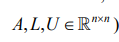
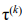
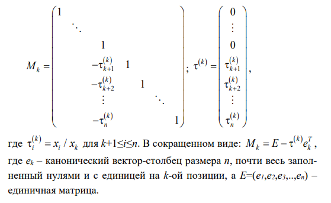
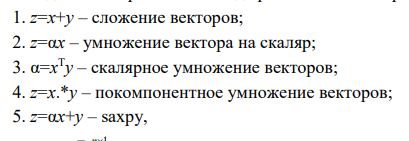

# Мой вопрос

## Векторные алгоритмы LU-разложения, kij и kji случаи.

LU-разложение — представление матрицы A в виде произведения двух матриц L и U 

A = LU , где 

A – плотная матрица, L - нижняя треугольная матрица, U - верхняя треугольная матрица



LU-разложение часто используется для решения СЛАУ, нахождения обратной матрицы к исходной и нахождения определителя исходной матрицы.

LU - разложение матрицы A существует, если матрица невырожденна. Невырожденная матрица ― квадратная матрица, определитель которой отличен от нуля. Разложение единственно, если элементы главной диагонали одной из матриц L или U фиксированы (ненулевые).

Производство LU-разложения через модификацию матрицы внешним произведением тесно связано с методом исключения Гаусса решения СЛАУ. 

Есть произвольного размера n вектор x и, задумывая исключение из него всех элементов `x_i` с индексами больше k (1≤k≤n-1), сформируем следующую матрицу преобразования Гаусса  с вектором множителей Гаусса :



Далее представим воздействие матрицы преобразования Гаусса не на столбец, а на другую матрицу, пусть A: 


> Матричный вид

**LU через модификацию матрицы внешним произведением**
```
for k=1:n-1
    // В k-тый столбец ниже главной диагонали записываем вектор множителей Гаусса - он же k-тый столбец матрицы L ниже главной диагонали. Выше - нули в силу нижнетреугольности матрицы L 
    A(k+1:n,k) = A(k+1:n,k) / A(k,k)
    // Блок матрицы - фактически, тоже матрица. Отнимаем столбец - тот веткор множителей Гаусса на k-тую строку правее главной диагонали
    A(k+1:n,k+1:n) = A(k+1:n,k+1:n) - A(k+1:n,k)A(k,k+1:n)
end for
```


**kji-алгоритм LU-разложения, векторный вид**
```
for k=1:n-1
    A(k+1:n,k)=A(k+1:n,k)/A(k,k)
    for j=k+1:n
        A(k+1:n,j)=A(k+1:n,j)-A(k+1:n,k)A(k,j)
    end for
end for
```

**kji-алгоритм LU-разложения, скалярный вид**
```
for k=1:n-1
    for i=k+1:n
        A(i,k)=A(i,k)/A(k,k)
    end for
    for j=k+1:n
        for i=k+1:n
            A(i,j)=A(i,j)-A(i,k)A(k,j)
        end for
    end for
end for 
```

**kij-алгоритм LU-разложения, векторный вид**
```
for k=1:n-1
    A(k+1:n,k)=A(k+1:n,k)/A(k,k)
    for i=k+1:n
        A(i,k+1:n)=A(i,k+1:n)-A(i,k)A(k,k+1:n)
    end for
end for
```

**kij-алгоритм LU-разложения, скалярный вид**
```
for k=1:n-1
    for i=k+1:n
        A(i,k)=A(i,k)/A(k,k)
    end for
    for i=k+1:n
        for j=k+1:n
            A(i,j)=A(i,j)-A(i,k)A(k,j)
        end for
    end for
end for 
```




